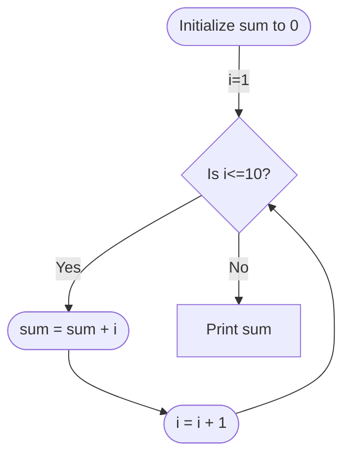

## What is an algorithm?
An algorithm is a method or a process followed to solve a problem

An algorithm must have the following properties:
- Correctness
- Composed of concrete unambiguous steps
- Finite number of steps
- Must terminate

## What is a data structure?
A data structure is a particular way of storing and organizing data in a computer so that it is used efficiently

## RAM model of computation
This is a highly simplified model of computation that we use to compute the efficiency of an algorithm
RAM = Random Access Machine

Properties:
1. Memory consists of an infinite array
2. Instructions are executed sequentially one at a time
3. All instructions take unit time. Running time is the number of instructions executed

## Pseudocode
To describe algorithms we use generic pseudocode, not a programming language
Typical framework

```
Algorithm: Description
--------------------------------------------------------
Input: input(s)
Output: Output(s)

Pseudocode that solves the problem
```

### Example

```
Algorithm to connect network cheaply
---------------------------------------------------------
Input: a network with costs for links
Output: a least cost “tree” that connects the network
---------------------------------------------------------
V is the set of nodes
E is the set of links
A is the empty set
sort E so that links are in order of increasing cost
while E is not empty do
	choose e in E with minimum cost
	if A + e contains no cycle then
		add e to A
	end if
	remove e from E
end while
return A
```

### Variables
If you have an important variable then declare type
E.g.,
1. Integer i
2. Float f
3. Char c
4. String s

Declare like:
- Integer i = 0
- String s := "Some string"
- Char c <- 'a'

Any convention fine
Note: Some languages use double quotes for strings and single for char
Can also declare on multiple lines

## Flowcharts
Algorithms can also be displayed using flowcharts
For example:
The algorithm:

```
integer sum = 0
for i = 1 to 10 do
	sum = sum + i
end for
print sum
```

Becomes the flow chart



