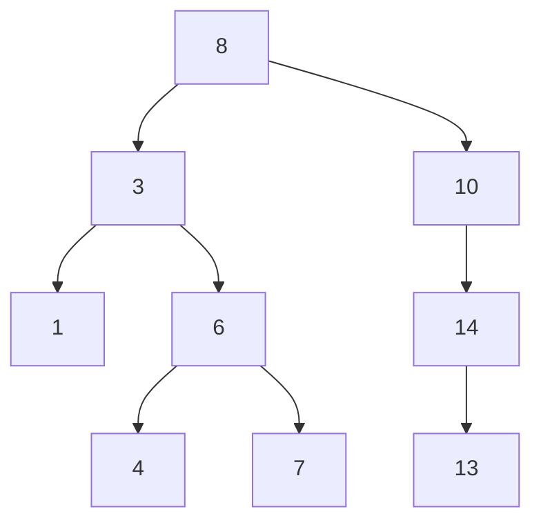

# Travelling Salesman Problem (TSP)
A salesman should visit cities
$$c_1,c_2,...,c_n$$
in some order, visiting each city exactly once and returning to the starting point
A positive integer cost $d(i,j)$ of travel between each pair $(c_i, c_j)$ is known

The goal of the problem is to find an optimal route for the salesman

Given a graph $G$ with set $V$ vertices, $\left( |V| = n \right)$ and set $E$ edges
- For each vertex $v$, create a city $c_v$
- For each pair of distinct $u,v \; \varepsilon \; V$, set $d(c_u,c_v) = 1$ if $uv \; \varepsilon \; E$ and $d(c_u,c_v) = 2$ otherwise

Then detecting a Hamiltonian cycle in $G$ can be viewed as a TSP:
- if $G$ has a Hamiltonian cycle then the cycle is a route of cost exactly $n$.
- if there is a route of cost $n$ then it can’t use pairs with cost $2$ (If use lose a pair with cost 2, the cost wont be $n$) and so goes through edges of $G$ and hence is a Hamiltonian cycle.

This is a **reduction** (from one problem to another)

# Trees
## Definitions
- A **forest** is an **acyclic** graph
	- i.e. graph **without cycles.**
- A **tree** is a **connected forest**,
	- i.e. a **connected acyclic graph**.

### Examples
The different trees on 6 vertices are shown below:

![[6VerticiesTrees.png]]
Doesn't matter where you put the edges - These are the only 6 types of trees but can be different variants of types

## Spanning trees
A sub graph $G′=(V′,E′)$ of a graph $G=(V,E)$ is spanning if $V′=V$
### Theorem
Every connected graph contains a spanning tree (a spanning subgraph that is a tree)
### An algorithmic proof
Let $G$ be a connected graph
- If $G$ contains no cycles, it is a tree, and hence a spanning tree of itself.
- If $G$ contains a cycle, we can remove one edge from the cycle.
- The new graph is still connected.
- Repeating this, we can destroy all cycles and end up with a spanning tree.

## Leaves in trees
A **leaf** in a tree is a vertex of degree $1$
### Lemma
Every tree of at least two vertices contains a leaf
#### Proof (Contradiction)
- Assuming that every vertex has degree $0$ or at least $2$, we will show that the graph is not a tree.
- If a vertex has degree $0$, then: the graph (which contains at least two vertices) is not connected, hence not a tree.
- If every vertex has degree at least $2$: just start at a vertex, go to one of its neighbours, from there go to another neighbour, etc.
- Since the vertex set is finite, at some stage we encounter a vertex we have already visited. 
- This implies that the graph contains a cycle, so is not a tree, contradiction

#### Alternative proof (Every vertex has degree at least $2$)
- Consider a longest path $P$ and an end vertex $v$ of $P$.
- All neighbours of $v$ are on $P$. 
- If $deg(v) \geq 2$, then there is a cycle.
- The same also holds for the other end vertex $u$ of $P$
$$=>deg(u) = deg(v)=1$$
## Edges of trees
### Theorem
A connected graph on $n$ vertices is a tree iff it has $n-1$ edges
#### Proof
$=>$
Show by induction on $n$, that a tree on $n$ vertices has $n−1$ edges.

- For small $n$ the lemma holds: a tree on one vertex has no edges; a tree on two vertices has one edge.
- Suppose each tree on $n−1$ vertices has $n−2$ edges (induction hypothesis)
- Take a tree $T$ on $n$ vertices, for some $n\geq 3$.
- $T$ contains a leaf $v$. Consider the graph $T−v$, it has one vertex less and one edge less than $T.$
- $T−v$ is still connected and (still) a cyclic.
- $T−v$ is a tree with $n−1$ vertices, by induction hypothesis it has $n−2$ edges.
- $T$ has one edge more, so $n−1$ edges.

$<=$

- Assume that $G$ is a connected graph with $n$ vertices and $n −1$ edges.
- Then, as we proved before, $G$ contains a spanning tree $T$.
- By the first part of the proof, $T$ contains exactly $n − 1$ edges.
- Hence, $T$ and $G$ are the same.
- $T$ is a subgraph of $G$, and it has the same number of edges as $G$.
- In particular, $G$ is a tree.

## Paths in trees
Since a tree is a connected graph, between any two vertices in a tree there is a path.
There can't be more than one path between two vertices in a tree
### Lemma
Let $T$ be a tree and $u,v \; \varepsilon \; V(T)$ with $u \ne v$
Then there is a **unique path** in $T$ between $u$ and $v$

#### Proof (Contradiction)
- There is a path between $u$ and $v$ in $T$ , since $T$ is connected.
- Suppose there are two paths $P$ and $Q$ in $T$ between $u$ and $v$ , and derive a contradiction.
- Let $x$ and $y$ in $V (T )$ be distinct and chosen in such a way that $x$ and $y$ are on both $P$ and $Q$, but between $x$ and $y$ the vertices on $P$ and $Q$ are disjoint. (It is possible that $x = u$ and $y = v$ , but this is not necessarily the case.)
- Then the segments of $P$ and $Q$ between $x$ and $y$ together form a cycle.
- This contradicts that $T$ is a tree. Hence there is a unique $(u, v )$-path in $T$ .

# Rooted trees
A (directed) **rooted tree** is a tree in which one vertex is fixed as the **root (vertex)** 
(and every edge is directed away from this root)

We usually draw a rooted tree in horizontal levels. Starting with the root (level 0), going up levels

## Children and parents
Let $v$ be a vertex in a rooted tree $T$
- The neighbours of $v$ in the next level are called the **children** of $v$
- The (unique) neighbour of $v$ in the previous level (if $v$ is not the root) is the **parent** of $v$
- if $v$ has no children, then it is called a **leaf** of $T$
- if $v$ has children, then it is an **internal** vertex

## Applications of trees
- BST
- Search trees
- Phylogenetic trees