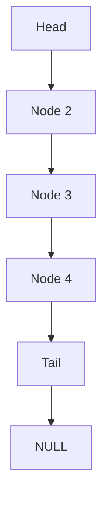
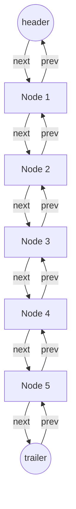
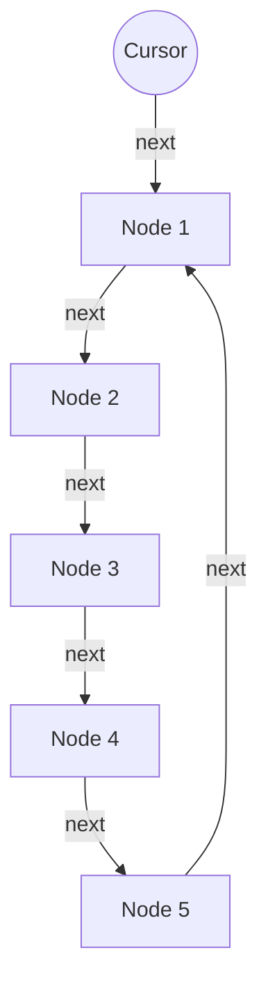

## Arrays
A data structure that stores a collection of elements, each identified by an index.
The elements in an array are stored in contiguous memory locations, and the index allows for easy and efficient access to any element in the array.
### How do we find the nth element of the list
Access the nth index
### How do we erase an element
Data can not be erased from an array as they are immutable
We can do alternatives such as shifting all elements, or swapping with the last element.

## Linked lists
A list made up of nodes.
Each node stores:
1. An element
2. A pointer to another node
First node is called the **head**
Last node is called the **tail** and points to null
Can be scattered all other memory

### How to implement a linked list
We have pointers to the first as well as the last node of list:
- L.head
- L.tail
- And possibly (L.size)
May refer to node N using:
- N.data
- N.next (May be NULL if at end tail)



#### Deletion of the head

```
Deletion of the head
-----------------------------------------------------------------
Input: list L
Output: L with head deleted
-----------------------------------------------------------------
if L.head = NULL then
	return no head to delete
end if
if L.head = L.tail then
	L.head = NULL
	L.tail = NULL
	L.size = L.size - 1
	return
end if
L.head = L.head.next
L.size = L.size - 1
```

#### Insertion of v after N

```
Insertion of v after N
---------------------------------------------------------
Input: list L, data v, node N
Output: L with v inserted after N
---------------------------------------------------------
node M
M.data = v
M.next = N.next
N.next = M
if L.tail = N then
	L.tail = M
end if
```

#### Arrays versus lists

|  | Array | Linked List |
| ---- | ---- | ---- |
| Data Access | Fast | Slow |
| Insertion, Deletion | Slow | Fast |

## Doubly linked list
A node in a doubly linked list stores two references:
- A next link, which points to the next node in the list
- A previous link, which points to the previous node in the list

To simplify we add two sentinel nodes at the ends of the doubly linked list:
- The **header** has a valid next reference but a NULL previous reference
- The **trailer** has a valid previous reference but a NULL next reference

Needs to store:
1. References to the two sentinel nodes
2. Size counter - Doesn't include sentinel nodes




### Deletion from a doubly linked list

```
Deletion from doubly linked list
--------------------------------------------------------------
Input: list L, node N
Output: L with N removed
--------------------------------------------------------------
M = N.prev
P = N.next
M.next = P
P.prev = M
L.size = L.size - 1
```

## Circularly linked list
Has some kind of nodes as a singly linked list and a reference to an element
Has no beginning or end
Last pointer points to the first node, instead of being NULL
Instead of references to the head and tail, we mark a node of the circularly linked list as the cursor. The cursor is the starting node when we traverse the list.


