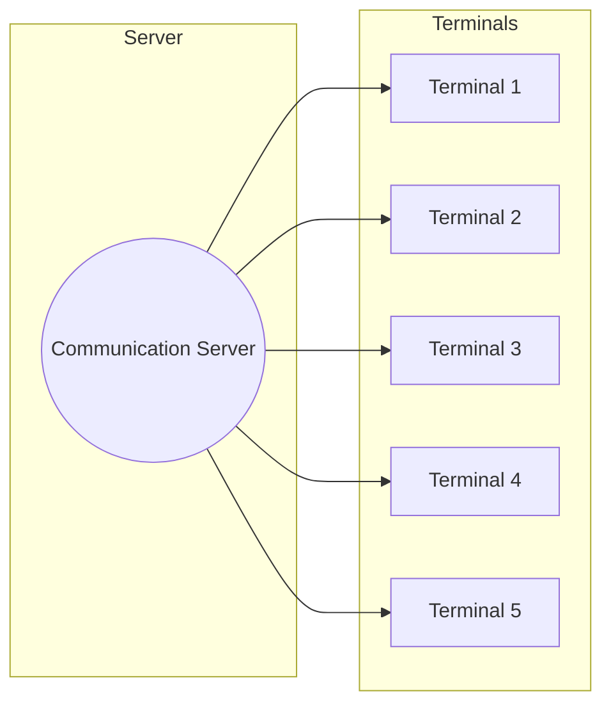
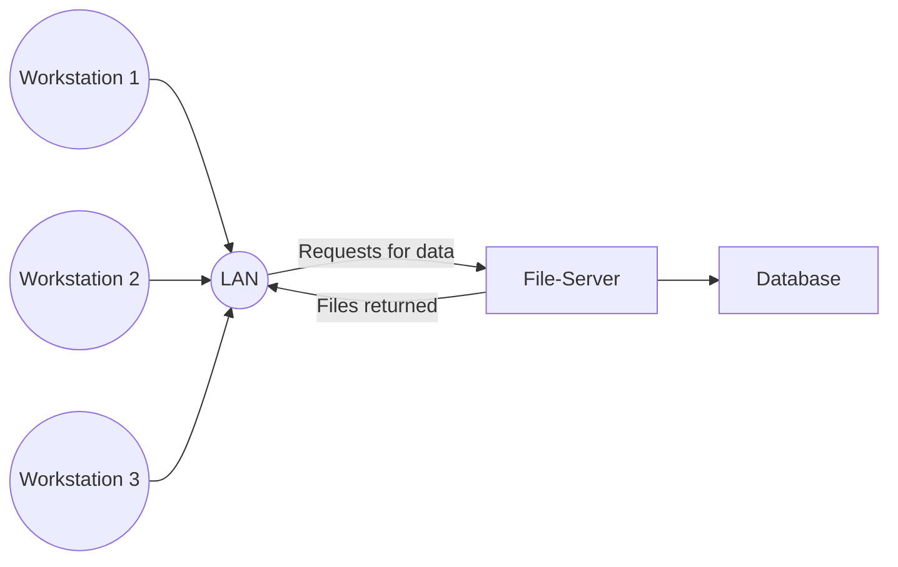

# Multi-User DBMS Architectures
- Several issue still need clarification
	- Is the DBMS on the end-user's computer?
	- If not, how are the suers connected to the DBMS? 
		- Physically, through LAN, etc
	- Which computations are performed where?
		- E.g., on the user's computer, on some server, etc
	- Is the database stored in one or many places?

## Teleprocessing Architecture
- The traditional (and most basic) architecture
- One central computer
	- With many single CPUs
- Many (end-user) terminals
	- All connected to the central computer
- All data processing in the central computer
	- Terminals send messages to the central computer
	- Central computer processes the queries and sends back the results to the terminal
	- Terminal only displays the results (No further computations)
- Tremendous burden on the central computer therefore decreased performance

This is quite large and the trend is towards downsizing
- We can replace expensive mainframe computers with cost-effective networks of PCs
- Achieve the same/ better reesults
The next two architectures do this:
1. File-server
2. Client-server
## File-Sever Architecture
Processing is distributed around a computer network
- LAN
- One central-file server
- Every workstation has its own DBMS
- Workstations request files from the file server
- File server acts like a shared hard disk

User's DBMS requests the whole tables
- Large amount of network traffic (Tables may be large)
- A full copy of the tables is required on each workstation
- Concurrency/ recovery/ integrity control is more difficult

To solve this we use a client-server architecture

## Client-Server architecture
### Two-Tier architecture
1. Client
	- Requires some resource
	- Provides UI
	- Main data processing logic
2. Server
	- Provides the resource
	- Performs validation and check
	- Handles database access

Many advantages
- Increased performance
	- Many client CPUs work in parallel
- Reduced hardware costs
	- Only the server needs increased storage and communication power
- Reduce communication costs
	- Less data traffic as only required data is transmitted
- Database still centralised
	- Not a distributed database

Main problems
- Hundreds of thousands of users
- Many difficult and complex applications
- "Fat clients" to run all applications
	- Extensive disk space/ RAM/ CPU
- Prevents scalability

Alternative:
- Three-tier architecture
	1. Client
	2. Applications
	3. Database

- Thin clients
	- increased performance of user's computer

### $n$-tier architecture
It can be extended: separation of tasks in $n$ intermediate tiers
- Increased flexibility/ scalability

Best example for a client: Internet browser
Advantages:
- lower hardware cost for the “thin clients”
- easier application maintenance
	- (centralized in one tier)
- easier to modify/replace one tier without affecting the others
- easier load balancing between the different tiers
- maps naturally to web applications

## Distributed DBMS
Software system to manage a distributed database
Makes the distribution transparent to users

Single logical database that is physically split into fragments
- Each fragment is
	- Stored on one or more computers/sites
	- Controlled by a separated DBMS
	- All computers/sites are connected in a network
- Each site has
	- Local authority
		- Independent processing of local data via local applications
	- Access to global applications
		- To process data fragments stored on other computers
- Not all sites have local applications or data but all have access to global applications

Data fragments may be replicated at more than one site
- Data consistency must be guaranteed

## Distributed processing vs distributed DBMS

### Distributed processing
- All data in one centralised database
- Only processing and user interface are distributed

### Distributed DBMS
- The data themselves are distributed
- Processing and UI too

## Design of a Distributed DBMS
In addition to ER modelling, we have to consider also:
- Fragmentation
	- How to break a relation into fragments
	- Fragments can be horizontal/vertical/mixed
- Allocation
	- How fragments are allocated at the several sites
	- Aim is to reach an "optimal" distribution (efficient, reliable)
- Replication
	- Which fragments are stored in multiple sites (and in which sites)
- Choice for fragmentation and allocation
	- Based on how the database is to be used
	- Quantitative and qualitative information needed
- Qualitative information (Mainly for fragmentation)
	- The relations/attributes/tuples required for transactions
	- The type of access (read/write)
- Qualitative information (mainly for allocation)
	- The frequency with which specific transactions are performed
	- The (usual) sites form which transactions are performed
	- Desired performance criteria for the transactions
- Strategic objectives for the choices of fragments
	- Locality of reference
		- Data to be stored close to where it is used
		- If a fragment is used at several sites $\rightarrow$ replication is useful
	- Reliability and availability
		- Improved by replication (But overhead to ensure consistency)
		- If one site fails, there are other fragment copies available
	- Acceptable performance
		- Bad allocation results on "bottleneck" effects
			- E.g., site receives too many requests $\rightarrow$ bad performance
		- Bad allocation causes underutilised resources
	- Cost of storage capacities
		- Affordable mass storage to be used at sites whenever possible
		- But must be balanced against the locality of reference
	- Minimal communication costs
		- Min. retrieval costs when max, locality of reference
		- But when replicated data are updated
			- All copies of this data must be updated
			- Increased network traffic/ communication costs

Four alternative strategies for the placement of data
- Centralized
	- Single database and DBMS
	- Stored at one site with users distributed across the network
	- Not distributed
- Fragmented
	- Database partitioned into disjoint fragments
	- Each data item assigned to exactly one site (No replication)
- Complete replication
	- Complete copy of the database at each site
- Selective replication
	- Combination of partitioning, replication, and centralisation

|  | Locality of reference | Reliability and availability | Performance | Storage costs | Communication costs |
| ---- | ---- | ---- | ---- | ---- | ---- |
| Centralised | Lowest | Lowest | Unsatisfactory | Lowest | Highest |
| Fragmented | High | Low for item. High for system | Satisfactory | Lowest | Low |
| Complete replication | Highest | Highest | Best for read | Highest | High for update, Low for read |
| Selective replication | High | Low for item, High for system | Satisfactory | Average | Low |

Three correctness rules for the fragment placement without replication
1. Completeness
	- If relation $R$ is decomposed into fragments $R_1, R_2, ..., R_n$, each data that can be found in $R$ must appear in at least one fragment $R_i$
2. Reconstruction
	- It must be possible to define a relational algebra expression that can reconstruct $R$ from its fragments
3. Disjointness
	- If a data item appears in fragment $R_i$ it should not appear in any other fragment
		- Exception for vertical fragmentation: PK attributes must be repeated for the reconstruction
## Types of Fragmentation
1. Horizontal
	- Fragment contains a subset of the tuples of the relation
2. Vertical
	- Fragment contains a subset of the attributes of the relation
3. Mixed
	- A vertical fragment that is then horizontally fragmented
	- Or visa-versa

### Horizontal fragmentation
- A relation Property contains two property types: Flat and House
- A horizontal fragmentation (By property-type) is:

$$P_1 = \Theta_{type='House'}(Property)$$
$$P_1 = \Theta_{type='Flat'}(Property)$$

This fragmentation may be useful if we have separate applications dealing with flats/houses and it is correct
- Completeness
	- Each tuple is either in $P_1$ or $P_2$
- Reconstruction
	- Property can be reconstructed from the fragments $P_1$, $P_2$:
$$Property=P_1\cup P_2$$
- Disjointness
	- There is no property that is in both flat and house

### Vertical fragmentation
For every staff member in a company
- The payroll department requires **StaffNo**, position, gender, salary
- The personnel departments requires: **StaffNo**, Name, DOB, branchNo

We have a relation Staff with all members of staff
A vertical fragmentation of Staff is:
$$S_1 = \Pi_{StaffNo, \; position, \; gender, \; salary}(Staff)$$
$$S_2 = \Pi_{StaffNo, \; Name, \; DOB, \; branchNo}(Staff)$$
Both fragments must include the PK staff No
- Allows reconstruction of Staff from $S_1$ and $S_2$
This would be useful as:
- fragments are stored at the departments that are needed
- performance for every department is improved(as the fragment is smaller than the original relation Staff

This fragmentation is correct:
- Completeness
	- The PK belongs to both $S_1$ and $S_2$
	- Any other attribute is in either
- Reconstruction
	- Staff can be reconstructed from the fragments $S_1$, $S_2$ using a natural join
$$Staff=S_1\Join S_2$$
- Disjointness
	- The fragments have disjoint attributes except for the PK

## Advantages and Disadvantages of distributed DBMS
|Advantages|Disadvantages|
|---|---|
|Reflects organizational structure |Complexity |
|Improved shareability and local autonomy |Higher maintenance cost |
|Improved availability and reliability |Security |
|Improved performance |Integrity control more difficult |
|Lower hardware cost |Design more complex |
|Scalability |Lack of experience in the industry |