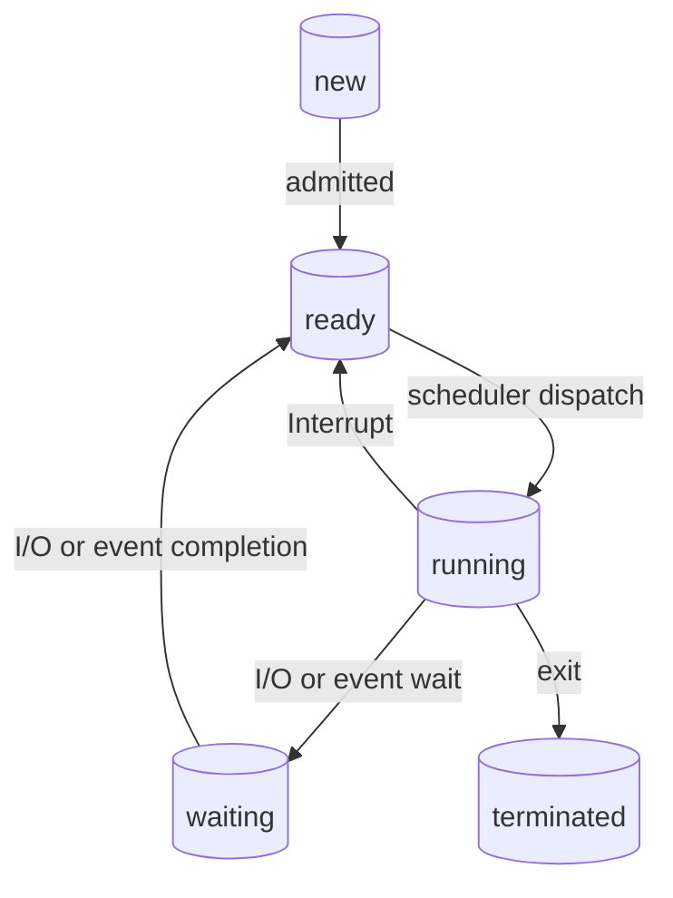

The operating system is a program that acts as an intermediary between a user and the hardware

Goals:
- Execute user programs
- Make solving user problems easier
- Make the computer system convenient to use
- Use the resources of the system and efficiently (priority, scheduling)

## Why do we need an operating system?
### Case 1 - OS is an abstract machine

- Extends the basic hardware with added functionality
- Provides high-level abstractions
	- More programmer friendly
	- Common core for all applications
		- E.g. Filesystem instead of just registers on a disk controller
- It hides the details of the hardware
	- Makes application code portable
### Case 2 - OS is a resource manager

- Responsible for allocating resources to users and processes
- Must ensure
	- No starvation
	- Progress
	- Allocation is according to some desired policy
		- First-come, first-served; etc.
	- Overall, that the system is efficiently used

## Computer system structure
Hardware - Provides basic computing resources
- CPU, memory, I/O devices

Operating system
- Controls and coordinates use of hardware among various applications and users

Application programs
- Define the ways in which the system resources are used to solve the computing problems of the users
- Word processors, compilers, web browsers, database systems, video games

Users
- People, machines, other computers

An operating system is a:
- Resource allocator
	- Responsible for the management of the computer system resources
- Control program
	- Controls the execution of user programs and operation of the input / output (I/O) devices to prevent errors and improper use of the computer
- Kernel
	- The one program that runs at all times
	- Runs in privileged mode
		- Contains fundamental functionality
			- Whatever is required to implement other services
			- Whatever is required to provide security
		- Applications should not be able to interfere or bypass the OS
			- OS can enforce its resource allocation policies
			- Prevent applications from interfering with each other

### Operating-system operations
**Dual-mode** operation allows OS to protect itself and other system components
- **User mode** and **kernel mode** **(or supervisor, system, privileged mode)**
- **Mode bit** provided by hardware
	- Provides ability to distinguish when system is running user code or kernel code
	- Some instructions designated as **privileged**, only executable in kernel mode
	- System call changes mode to kernel, return from call resets it to user 

Increasingly CPUs support multi-mode operations
- i.e. **virtual machine manager (VMM)** mode for guest **VMs**

#### Privileged instructions
Some instructions must be accessible only to the operating system:
**privileged instruction set** includes functions such as:
- Manages interrupts (incl. enabling, disabling)
- Performing I/O
- Halting a process!

#### Transition for User to Kernel Mode
Switching from user mode to kernel mode occurs when:
- a user process calls on the operating system to execute a function needing a privileged instruction (system call).
- an interrupt occurs (hardware).
- an error condition occurs in a user process (software).
- an attempt is made to execute a privileged instruction while in user mode

#### Other operations include
- Resource management
- Process management
- Memory management
- Mass storage management
- File system management

## Operating system types
1. Multi-user
	- Allows two or more users to run programs at the same time
2. Multi-programming
	- Supports running a program on more than one CPU
3. Multi-tasking
	- Allows more than one program to run concurrently
4. Multi-threading
	- Allows different parts of a single program to run concurrently
5. Real time
	- Responds to input instantly
6. Etc

### Multi-programming
Multiprogramming needed for efficiency
- Single user cannot keep CPU and I/O devices busy at all times
- Multiprogramming organizes jobs (code and data) so CPU always has one to execute
- A subset of total jobs in system is kept in memory
- One job selected and run via job scheduling
- When it has to wait (for I/O for example), OS switches to another job

![[Operating system image.png]]
### Multi-tasking
Timesharing (multitasking) is logical extension in which CPU switches jobs so frequently that users can interact with each job while it is running, creating interactive computing
- Each user has at least one program executing in memory $\rightarrow$ process
- If several jobs ready to run at the same time $\rightarrow$ CPU scheduling
- If processes don’t fit in memory, swapping moves them in and out to run
- Virtual memory allows execution of processes not completely in memory

### Operating system services

![[Operating system services image.png]]
- Operating systems provide an environment for execution of programs and services to programs and users
- One set of operating-system services provides functions that are helpful to the user:
	- **User interface**
	- **Program execution** 
		- The system must be able to load a program into memory and to run that program, end execution, either normally or abnormally (indicating error)
	- **I/O operations**
		- A running program may require I/O, which may involve a file or an I/O device
	- **File-system manipulation** 
		- Programs need to read and write files and directories, create and delete them, search them, list file Information, permission management.
	- **Communications** 
		- Processes may exchange information, on the same computer or between computers over a network
		- Communications may be via shared memory or through message passing (packets moved by the OS)
	- **Error detection**
		- OS needs to be constantly aware of possible errors
		- May occur in the CPU and memory hardware, in I/O devices, in user program
		- For each type of error, OS should take the appropriate action to ensure correct and consistent computing

Another set of OS functions exists for ensuring the efficient operation of the system itself via resource sharing
- **Resource allocation**
	- When multiple users or multiple jobs running concurrently, resources must be allocated to each of them
	- Many types of resources - CPU cycles, main memory, file storage, I/O devices.
- **Accounting**
	- To keep track of which users use how much and what kinds of computer resources
- **Protection and security** 
	- The owners of information in a multiuser or networked computer system may want to control the use of that information, concurrent processes should not interfere with each other
		- **Protection** involves ensuring that all access to system resources is controlled
		- **Security** of the system from outsiders requires user authentication, extends to defending external I/O devices from invalid access attempts

### User OS interfaces
#### CLI
CLI or command interpreter allows direct command entry
#### GUI
Graphical user-friendly desktop interface

Many systems now include both CLI and GUI interfaces

### OS design and implementation
Implementation depends on:
- **User** goals and **System** goals
	- **User goals**
		- Should be convenient to use, easy to learn, reliable, safe, and fast
	- **System goals**
		- Should be easy to design, implement, and maintain, as well as flexible, reliable, error-free, and efficient
- Important principle to separate
	- **Policy:** **What** will be done?
	- **Mechanism:** **How** to do it?
		- The separation of policy from mechanism is a very important principle, it allows maximum flexibility if policy decisions are to be changed later (example – timer)

## Operating System structure
- General-purpose OS is very large program
- Various ways to structure ones
	- Simple structure - MS-DOS
	- More complex - UNIX
		- Monolithic
		- Layered
		- Microkernel

### Simple Structure
MS-DOS written to provide the most functionality in the least space
- Not divided into modules
- Although MS-DOS has some structure, its interfaces and levels of functionality are not well separated

### Non simple structure
Another strategy – single file, single address space aka **Monolithic**. 
UNIX – limited by hardware functionality, the original UNIX operating system had limited structuring. The UNIX OS consists of two separable parts
- Systems programs
- The kernel
	- everything below the system-call interface and above the physical hardware
	- Provides the file system, CPU scheduling, memory management, and other functions; a large number of functions for one level

#### Layered approach
The operating system is divided into a number of layers (levels), each built on top of lower layers. The bottom layer (layer 0), is the hardware; the highest (layer N) is the user interface.
With modularity, layers are selected such that each uses functions (operations) and services of only lower-level layers

#### Monolithic operating system structure
Everything is tangled up with everything else
Linux, Windows

#### Microkernel system structure
Moves as much from the kernel into user space
**Mach** example of **microkernel**
- Mac OS X kernel (Darwin) partly based on March
Communication takes place between user modules using **message passing**

Detriments:
- Performance overhead of user space to kernel space communication

# Process
A program in execution is called a process

An operating system executes a variety of programs:
- Batch systems - Jobs
- Time Shared Systems - User Programs or Tasks

Resources needed by the process include: CPU time, memory, files, and I/O devices.
- The resources may be allocated at the start of a process or as it executes

Executes using its associated resources; a collection of instructions that carry-out a reasonable task

The operating system is responsible for process management including:
- Process creation and deletion
- Process holding and resuming
- Mechanisms for process synchronization (via priority, scheduling)

## The process concept
A process includes:
- Code
	- Text section
- Current activity
	- Represented by the program counter and the content of the CPU's registers
- Stack
	- Temporary data such as local variables
- Data section
	- Global variables
- Heap
	- Memory allocated while the process is running

## Process Control Block (PCB)
A process' information is stored in a PCB, also known as the task control block

The PCB's form a process table
- Reality can be more complex (Hashing, chaining, allocation bitmaps, … )

Information about each process in PCB includes:
- Unique identifier
	- e.g., PID
- State
	- ~ status
- CPU registers
- CPU scheduling information e.g., priority
- Memory usage
- Other information: Accounting, I/O status.

### Process state
As a process executes, it changes state (~status):
- New
	- The process is being created
- Running
	- Instructions are being executed
- Waiting
	- The process is waiting for some even to occur
- Ready
	- The process is ready to be dispatched to the CPU
- Terminated
	- The process has completed its execution, or some other event causing termination 

### Process creation
A new process, as a parent process, can create a number of child processes, which, in turn create other processes, forming a tree of processes.

Generally, process identified and managed via a process identifier (pid)
Resource sharing: three possible cases:
1. The parent and child processes share all resources
2. The child process shares a subset of parent's resources
3. The parent and child processes share no

Execution: two possible cases:
1. The parent and child execute concurrently 
2. The parent waits until child terminates

Address space:
- Child duplicates that of a parent
- Easier communication with parents

UNIX examples
- fork()
	- System call creates new process
- exec()
	- System call used after a fork() to replace the process' memory space with a new program

![[Pasted image 20240402101815.png]]

### Process Termination
The process executes its last statement and asks the operating system to delete it using exit() system call:

- Outputs data from the child's process to parent (via wait())
- The child process's resources are de-allocated by operating system

The parent process may terminate execution of child processes if:

- The child process has exceeded its allocated resources
- The task assigned to child is no longer required
- The parent is itself terminating (cascade termination - all children, grandchildren, etc. are terminated).

If no parent waiting (did not invoke **wait()**), process is a **zombie**
If parent terminated without invoking **wait**, process is an **orphan**

### Process scheduling
Maximise CPU use, quickly switch processes onto CPU for time sharing
Process scheduler selects among available processes for next execution on CPU
Maintains scheduling queues of processes
- Job queue
	- Set of all processes in the system
- Ready queue
	- Set of all processes residing in main memory, ready and waiting to execute
- Device queues
	- Set of processes waiting for an I/O device
- Processes migrate among the various queues

Queueing diagram represents queues, resources, flows

![[Pasted image 20240220160727.png]]

## The kernel
Aim - To provide an environment in which processes can exist

Four essential components:
- Privileged instruction set
- Interrupt mechanism
- Memory protection
- Real-time clock

The kernel consists of:
- The first-level interrupt handler (FLIH)
	- To manage interrupts
- The dispatcher (or scheduler)
	- To switch the CPU between processes
- Intra operating system communications
	- Via the system bus

### First-level interrupt handler (FLIH)
The function of the FLIH is to:
- Determine the source of the interrupt (prioritise)
- Initiate servicing of the interrupt (selection of suitable process of the dispatcher)

### The dispatcher
Assigns processing resource for processes

Is late initiated when:
- A current process cannot continue
- The CPU may be better used elsewhere, for instance:
	- After an interrupt changes a process state
	- After a system call which results in the current process not being able to continue
	- After an error which causes a process to suspend

### Threads
Unit of execution

Can be traced
- List the sequence of instructions that execute

Belongs to a process
- Executes within it

Either
- User threads
- Kernel threads

#### Multithreading vs single threading
##### Multithreading:
OS supports multiple threads within a single process

##### Single threading
OS does not recognize the separate concept of thread. Such as MS-DOS supports a single user process and a single thread

![[Pasted image 20240220161640.png]]

#### Thread Model
![[Pasted image 20240220161658.png]]

Local variables are per thread
- Allocated on the stack
	- Each thread has its own stack

Global variables are shared between all threads
- Allocated in data section
- Concurrency control is an issue

Dynamically allocated memory can be global or local
- Program defined

#### Benefits
- **Timing** – Less time to create or terminate (or to switch between threads) a thread than a process.
- **Responsiveness** – may allow continued execution if part of process is blocked, especially important for user interfaces
- **Resource Sharing** – threads share resources of process, easier than shared memory or message passing
- **Economy** – cheaper than process creation, thread switching lower overhead than context switching
- **Scalability** – process can take advantage of multiprocessor architectures

#### Concurrency vs. Parallelism
Concurrent execution on single-core system

![[Pasted image 20240220161928.png]]

Parallelism on a multi-core system:

![[Pasted image 20240220161934.png]]

#### Amdahl's law
Identifies performance gains from adding additional cores to an application that has both serial parallel components

$S= serial \; portion$
$N = Processing \; cores$

$$Speedup \leq \frac{1}{S+\frac{(1-S)}{N}}$$
As $N \rightarrow \infty$, speedup approaches $\frac{1}{S}$

#### Multithreading Models
##### 1. Many-to-one
- Many user-level threads mapped to single kernel thread
- One thread blocking causes all to block
- Multiple threads may not run in parallel on muti core system because only one maybe in kernel at a time

![[Pasted image 20240220162247.png]]

##### One-to-one
- Each user-level thread maps to kernel thread
- Creating a user-level thread creates a kernel thread
- More concurrency than many-to-one
- Number of threads per process sometimes restricted due to overhead

![[Pasted image 20240220162346.png]]

##### Many-to-Many
- Allows many user level threads to be mapped to many kernel threads
- Allows the operating system to create as sufficient number of kernel threads

![[Pasted image 20240220162448.png]]

#### Threading creation
**Thread library** provides programmer with API for creating and managing threads. Two primary ways of implementing:
1. Library entirely in user space
2. Kernel-level library supported by the OS

![[Pasted image 20240220162548.png]]