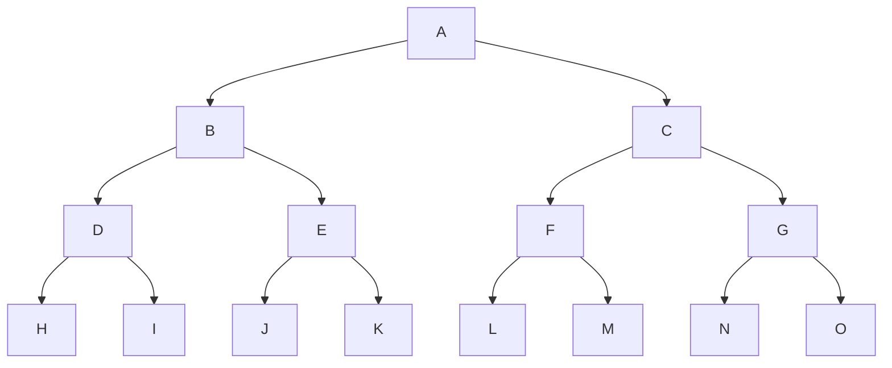
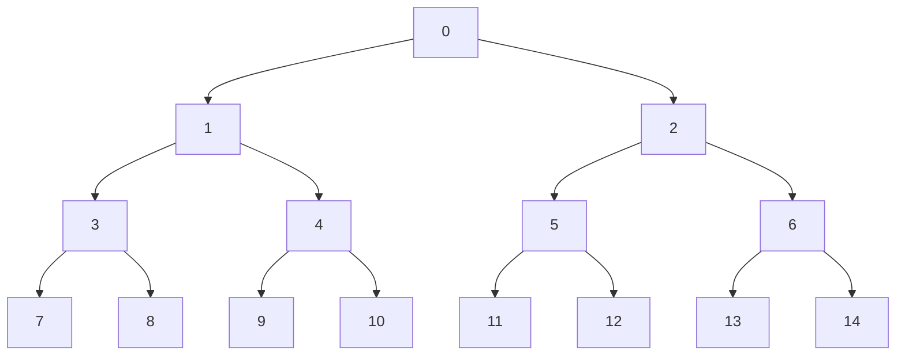
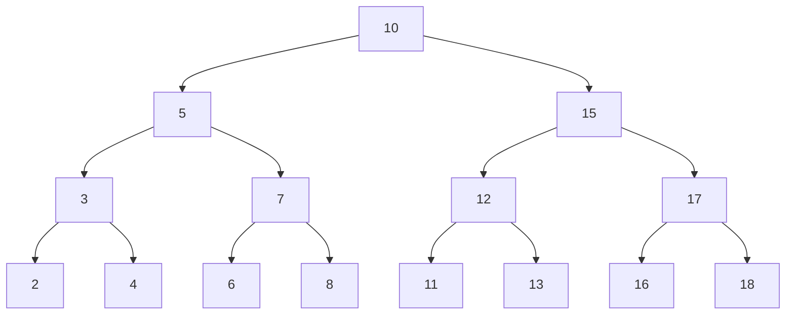

# Rooted binary tree
A tree whose elements have at most $2$ children is called a binary tree

Rooted means there is a root node (topmost node) which all other nodes are descendants of

- Has one entry point, the **root** (parentless)
- Every node has **at most** two children
- Each node has unique parent
- Childless nodes are called "leaves"

## Properties of rooted binary trees
Every node is connected by a directed edge from exactly one other node
- Edge:
	- The link from one node to another
- Siblings
	- Two nodes that have the same parents
- Path length
	- The number of edges that must be traversed to get from one node to another

### Lemma
Let $T$ be a rooted binary tree of height $h$
- $T$ has at most $2^{h+1}-1$ nodes
- $T$ has at most $2^h$ leaves

#### Proof
The max number of nodes is in a complete tree of height $h$,
$$2^0+2^1+2^2+2^3+...+2^h=2^{h+1}-1$$
The second statement follows by induction
Case $h=0$ is obvious
Consider left and right subtrees of the root of $T$
Then each of them has height $\le h-1$ and by induction hypothesis $\leq 2^{h-1}$ leaves.
Then $T$ has at most $2^{h-1}+2^{2h-1}=2^h$ leaves

## Size and depth
The **size** of a binary tree is the number of nodes in it
The **depth** of a node is its distance from the root
- Root has depth 0

The **depth** of a binary tree is the depth of its deepest node

## Array representation of a binary tree
Each leaf fills an index of the array
Index 0 contains the root
Moving down each layer starting from the left and going to the right counts up,
The tree below shows the indexes

## Searching a binary tree
Start at the root
Search the tree level by level, until you find the element you are search for or you reach a leaf
$$O(n)$$

# Binary Search Tress (BST)
All elements of the left sub-tree are "smaller" than the node
All elements on the right sub-tree are "larger" than the node

## BST traversal
### Pre order traversal
The root is visited *first*

You place a flag on the left side on the tree, and work around that
![[Pre order traversal.png]]

### In order traversal
The root is visited in the middle

You place a flag underneath each node, and work around that
![[In order traversal.png]]
### Post order traversal
The root is visited last

You place a flag on the right side of each node, and work around that
![[Post order traversal.png]]

## Inserting in a BST
Inserting a new node into a BST is simple, just follow the binary search tree rules until you find a leaf, then insert correctly.

## Searching in a BST
Searching for a node, just follow the binary search tree rules until item is found, or until at a leaf, and then return null.

## Deleting from a BST
### No child
Just delete the node from the tree

### 1 child
Root the child node to the parent of the node you are deleting, then delete

### 2 children
Search for the successor node, the smallest element bigger than the one you are deleting, then make replace the node you are deleting

## Complexity of a BST
- $O(h)$ - Searching, insertions, deletions
	- $O(\log n)$ average case
- In the worst case, there degenerate to $O(N)$
	- This can be avoided by using balanced trees
		- AVL, Red-Black