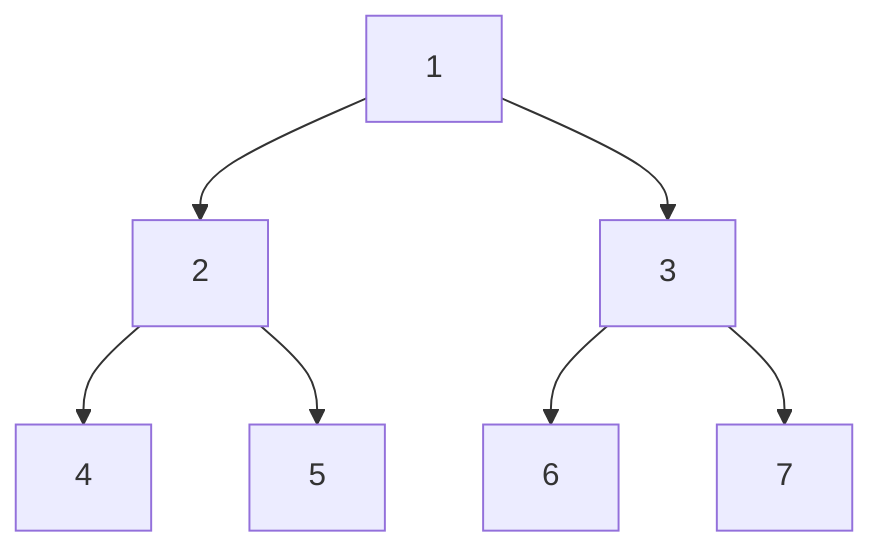
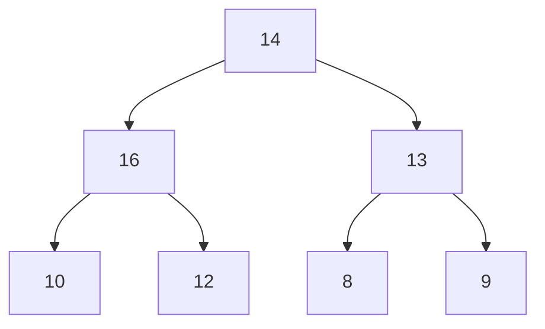

Heaps are trees that are typically stored in a flat array
A heap is complete if every node has either $0$ or $2$ children
A heap is full if every level is complete

# Types of heap
There are $2$ types of heap:
1. Max heap
2. Min heap

## Max heap
For every node excluding the root, the node value is at most that of its parent
Largest element stored at root

### Example

## Min heap
For every node excluding the root, the node value is at least that of its parent
Smallest element stored at root

### Example

## Heap properties
It is a binary tree with the following properties:
- Property 1
	- Complete binary tree
- Property 2
	- The value stored at a node is greater or equal to the values stored at the children (max heap)

Heap represented as an array $A$ has two attributes
1. $Length(A)$ - Number of elements in array $A$
2. $HeapSize(A)$ - Number of elements in heap stored in $A$

Need $Length(A)\geq HeapSize(A)$ at all times

Height of heap $h=\log n$

### Array indices
Root is $A[1]$
Left is $A[2\times i]$
Right is $A[2\times i+1]$
Parent is $A\left[\frac{i}{2}\right]$ - Integer division, rounds down

## BuildHeap
### Insertion into a heap
To insert element to a binary max-heap $H$
1. Add the new element node to the bottom left of $H$
2. If the new node value is bigger than its parent, swap their values. (Heapify)

### Heapify
Start at the root. identify largest element between itself and it's children
Swap with largest element (if not root)
Recurse into node that swapped

#### Example

We can see that $16$ and $14$ are in the wrong order, therefore swap

There are no other contradictions, therefore fine, we know this by recursing into $14$.

### Running time
**Loose upper bound:**
- Cost of a Heapify call $\times$ No. of calls to MaxHeapify
- $O(\log n) \times O(n) = O(n \log n)$

**Tighter bound**
- Cost of call to Heapify at a node depends on the height $h$, of the node $O(h)$
- Height of most nodes smaller than $n$
- Height of nodes $h$ ranges from $1$ to $[ \lg n]$
- No. of nodes of height $h$ is $[\frac{n}{2^h}]$

$$T(n)=\Sigma^{\log n}_{h=1}(\# nodes \; at \; height \; h) \times O(h)$$
$$\leq \Sigma^{\log n}_{h=1} \frac{n}{2^h}\times O(h) = O\left(\Sigma ^{\log n}_{h=1} \frac{n}{2^h}\times O(h)\right) = O\left( n\times \Sigma^{\log n}_{h=1} \frac{h}{2^h}\right)$$
Well known: for $x \; \varepsilon \; (0,1)$

$$\Sigma ^{\infty}_{i=0} i \times x^i = \frac{x}{(1-x)^2}$$
$$\Sigma^{\log n}_{h=1} \frac{h}{2^h}\leq \Sigma^{\infty}_{h=0} \; h \times \left( \frac{1}{2}\right)^h$$
$$=\frac{\frac{1}{2}}{\left(1-\frac{1}{2}\right)^2}=\frac{\frac{1}{2}}{\frac{1}{4}}=2$$
and hence
$$T(n)=O\left(n \times \Sigma^{\log n}_{h=1} \; \frac{h}{2^h}\right)=O(n)$$

## Extraction (Deletion)
An element is always deleted from the root of the heap. So deleting an element from the heap is done in these major steps

1. Replace the root node's value with the last node's value so that $H$ is still a complete binary tree but not necessarily a heap
2. Delete the last node
3. Move down the new root node's value so that $H$ satisfies the heap property. In this step, interchange the root node's value with its child node's value (whichever is largest among its children)

## HeapSort
Trivial:
- Call BuildHeap on unsorted data, and
- repeatedly call HeapExtractMin until empty

**Running time:**
$$O(n)+n\times O(\log n) = O(n \log n)$$

