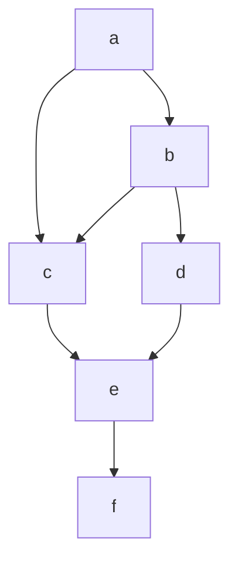
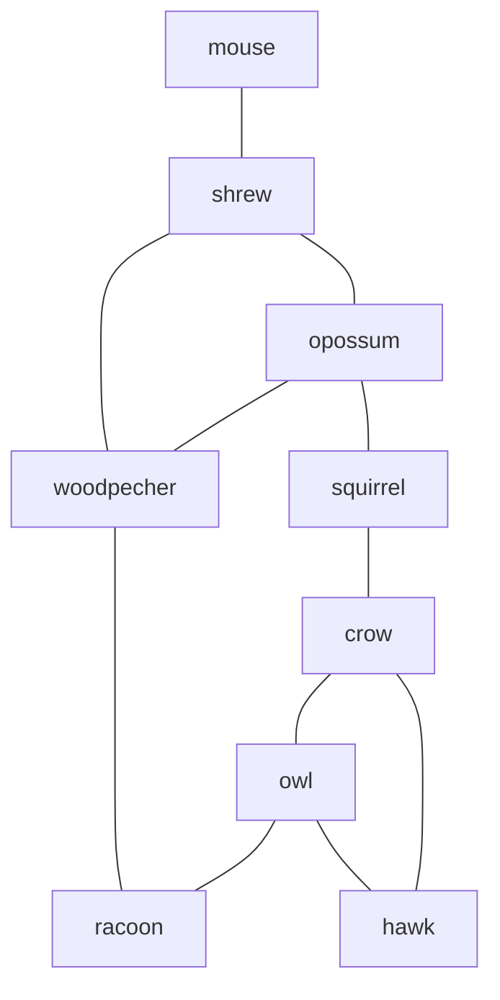
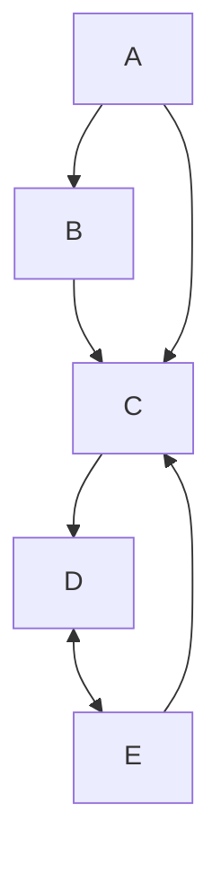
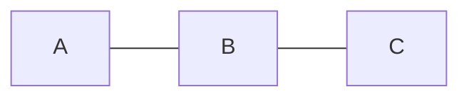
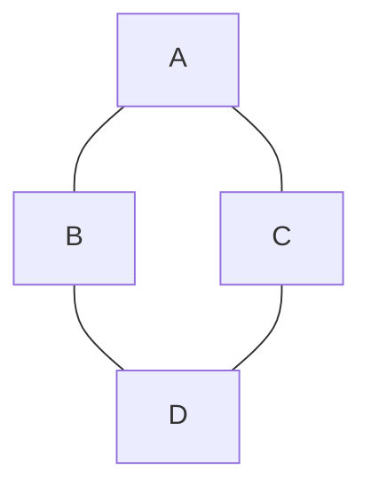

# Formal definition of a graph
A graph $G$ is a pair $(V(G), E(G))$, where $V(G)$ is a **nonempty** set of **vertices** (or nodes) and $E(G)$ is a set of **unordered pairs** $\{u,v\}$ with $u, v \; \epsilon \; V(G)$ and $u \ne v$ called the **edges** of $G$

- $V(G)$ can be infinite, but all our graphs here will be finite.
- If no confusion can arise, we write $uv$ instead of $\{u,v\}.$
- If the graph $G$ is clear from the context, we write $V$ and $E$ instead of $V(G)$ and $E(G)$ 

## A drawing of a graph

This is a drawing of the graph $G = \left(V,E\right)$ with $V = \{a, b, c, d, e, f \}$ and $E = \{ab, ac, bc, bd, ce, de, ef \}$

## Types of graphs
Possible variations in definition:
- **directed** graphs or **digraphs**
	- edges can have **directions**.
- **multi-graphs**
	- **multiple edges** are allowed between two vertices.
- **pseudo-graphs**
	- edges of the form $uu$, called **loops**, are allowed.
- **vertex- or edge-weighted** graphs
	- vertices and/or edges can have weights

By default, all our graphs are **simple undirected or simple directed** graphs (sometimes **edge-weighted** too), i.e. no multiple edges, no loops

### Case study example: System of species
undirected edge between two vertices: two species compete for the same food

Possible questions:
- “independent set”: largest set of non-competing species(to live together in a zoo)
- “minimum colouring”: partition into the smallest number of independent sets(smallest number of rooms in the zoo

### Case study example: Social network
- vertices are persons
- directed edge from $x$ to $y$ : person $x$ influences person $y$

Possible question:
- “dominating set”: smallest number of persons, which collectively influence all others (best influencer set), e.g. $\{A, E \},\; \{A, D\}, . . .$

## Terminology
Let $G$ be a graph and $uv$ an edge in it. Then
- $u$ and $v$ are called endpoints of the edge $vu$
- $u$ and $v$ are called  neighbours or adjacent vertices
- $uv$ is said to be incident to $u$ (and to $v$)
- if $vw$ is also an edge (where $w\ne u$) then $uv$ are called adjacent

### More terminology
Let $G = (V,E)$ be a graph. The **neighbourhood** of a vertex $v \; \epsilon \; V$ notation $N(v)$, is the set of neighbours of $v$ i.e., $N(v) =\{ u \; \epsilon \; V \; | \; uv\; \epsilon \; E \}$

The **degree** of a vertex $v \; \epsilon \; V$ notation $deg\left(V\right)$, is the number of neighbours of $v$, i.e., $deg(v) = |N(v)|$

With $\delta(G)$ of $\delta$ we denote the **smallest degree** in $G$, and with $\Delta(G)$ or $\Delta$ the **largest degree**

A vertex with degree $0$ will be called an **isolated vertex**
A vertex with degree $1$ an **end vertex** or a **pendant vertex**

A **subgraph** $G' = \left(V', E'\right)$ is a graph with $V' \subseteq V$ and $E' \subseteq E$. This subgraph is called **proper** if $G' \ne G$ and **spanning** if $V' = V$

It is called **induced subgraph** if $E'$ contains **all** edges of $E$ between vertices of $V'$ i.e., it is obtained by just removing from $G$ all vertices of $V \backslash V'$ (and their edges)

#### Examples

![[Pasted image 20240313162315.png]]

The graph $H_1$ is a subgraph of $G$ , but not a spanning subgraph, so it is also a proper subgraph of $G$.

$H_2$ is not a subgraph of 'G' : $cd \notin E (G ).$
The pair $\left(\{a, b, c\}, \{ab, bd\}\right)$ is no subgraph of $G$ either, since it is not a graph

# First theorem in Graph theory
## Theorem
Let $G = \left(V,E\right)$ be a graph. Then $\Sigma_{v \epsilon V} deg(v)=2|E|$
### Proof
Every edge has two endpoints and contributes one to each of their degrees, so contributes two to the sum of the degrees of all the vertices of $V$.

## Corollary
In every undirected graph $G$ , the number of vertices with an odd degree (i.e. number of neighbours) is even.

### Proof
Let $G = \left(V,E\right)$. Partition $V$ to add two subsets
- $V_{odd} = \{v: \; deg(v) \; is \; odd\}$
- $V_{even} = \{v: \; deg(v) \; is \; even\}$

Clearly, $\Sigma_{v \epsilon V} deg(v)$ is even. By the handshaking Lemma it follows that:
$$\Sigma_{v \epsilon V_{odd}} deg(v)=2|E| - \Sigma_{v \epsilon V_{even}}deg(v)$$
 Is even too
 
 Now, if we have an odd number of vertices with odd degree, then $\Sigma_{v \epsilon V_{even}}deg(v)$ is odd, a contradiction
 
 Thus there is an even number of vertices with odd degree
## The most basic graph classes

This graph is often denoted by $P_3$ and in general we define $P_n$ as the path $n$ vertices i.e., a graph with vertex set $V = \{v_1, v_2, ..., v_n\}$ and edge set $E=\{v_1,v_2,v_3,...v_{n-1},v_{n}\}$
So $P_n$ has $n-1$ edges

**Definition**
A path in a graph $G$ is a subgraph of $G$ which is (isomorphic to) the graph $P_k$ for some integer $k \geq 1$. Sometimes a path is also called a **simple path**

---

The second graph is often denoted by $C_4$, the cycle on $4$ vertices. In general a $C_n$ on $n$ vertices is defined similarly to the $P_n$, but now with an additional edge between $v_n$ and $v_1$. So, $C_n$ has $n$ edges. 

**Definition**
A **cycle** in a graph $G$ is a subgraph of $G$ which is (isomorphic to) the graph $C_k$ for some integer $k \geq 3$. Sometimes a cycle is also called a **simple circuit**

---

![[Pasted image 20240214120913.png]]

All four of these graphs can be described as a $K_{p,q}$: a graph consisting of two disjoint vertex sets on $p$ and on $q$ vertices, and all possible edges between these two vertex sets (and no other edges). So, $K_{p,q}$ has $p . q$ edges. 

**Definition**
$K_{p,q}$ is called a **complete bipartite** graph. Any subgraph of $K_{p,q}$ is called a **bipartite** graph.
So a graph is bipartite if and only if we can partition its vertex set to two vertex sets such that every edge has one endpoint in each set.

## Some graph classes
### Definition
A **complete** graph on n vertices, denote by $K_n$, contains **all** the possible edges between pairs of vertices.

How many edges has a $K_n$? 
Answer: $\left(\frac{n}{2}\right) = \frac{1}{2}n(n-1)$ 

### Definition
The **(n-dimensional) hypercube** or **n-cube** $Q_n (n\geq1)$ is the graph with

$$V = \{\left(e_1, ..., e_n\right) \; | \; e_i \; \epsilon \; {0,1} \; (i=1, ..., n)\}$$

in which two vertices are neighbours if and only if the corresponding rows differ in exactly one entry
![[n-cube.png]]
### Theorem
All $n-cubes$ are bipartite
#### Proof
- We give a **bipartition** of the vertex set of the $n-cube$.
- Let $V_1$ contain all the vertices with an **odd** number of $1s$
- Let $V_2$ contain all vertices with an **even** (possibly $0$) number of $1s$.
- This is clearly a partition of $V$ into two disjoint sets.
- It is easy to see that each edge has one endpoint in each of the sets.
- So it proves that all $n-cubes$ are bipartite.