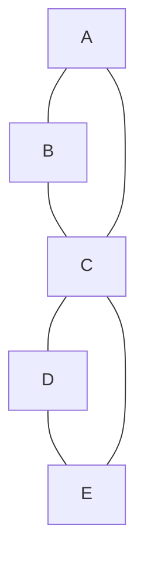

# Walks, paths, cycles, and distances
- A **walk** in a graph $G$ is a sequence of edges $v_0v_1,v_1v_2,v_2v_3, ... , v_{n-1}v_n$ In this case we also say that $v_0,v_1,...,v_n$ is a walk in $G$.

- A walk $v_0,v_1,...,v_n$ in $G$ is a **path** if all $v_i's$ are distinct. In this case we also say that $v_0,v_1,...,v_n$ is a path in $G$

- A walk $v_0,v_1,...,v_n$  with $v_0$ = $v_n$ is called a **circuit** or **closed walk**

- A closed walk is a **cycle** (or **simple circuit**) if all $v_i's$ in it are distinct except $v_0 = v_n$.
- If $G$ is a directed graph then the **directed paths** and **directed cycles** are defined in a natural way, with each edge being directed from $v_i \; to \; v_{i+1}$.

- The **length** of a path or a cycle is the number of edges in it.
- The **distance** between vertices $u$ and $v$ in a graph, denoted $dist(uv)$, is the length of a shortest path from $u$ to $v$ if such a path exists, and $\infty$ otherwise.
- The **diameter** of a graph is the largest distance between two vertices in it

### Exercise
![[ExampleQuestion.png]]
**Does this graph contain a path level of 7**
![[Pasted image 20240222133941.png]]
**Does this graph contain a cycle of length 7**
![[Pasted image 20240222133954.png]]
**What is the distance from 2 to 6**
![[Pasted image 20240222134003.png]]
**What is the diameter of this graph**
Have to exhaust every option

## Shortest-path problems
In a graph (possibly with edge weights, the problem of computing a path from a given vertex $u$ (source) to a given vertex $v$ (target) with the smallest total length (or weight) is known as the shortest-path problem.

## Connectivity 
### Definition
A graph $G=\left(V,E\right)$ is called **connected** if between every pair of vertices $u,v$ there exists at least one path in $G$

A **connected component** of $G$ is a **maximal** connected subgraph of $G$

This graph is connected
![[ExampleQuestion.png]]

This graph is not
![[Unconnected Graph.png]]

### Connected components
**Theorem**
Every graph $G=\left(V,E\right)$ contains at least $|V|-|E|$ connected components

**Proof**
By induction over $m = |E|$
**Induction basis:**
$m = 0$. No edges, so only isolated vertices, i.e. $|V|$ connected components

**Induction step:**
Let $G = \left(V , E\right)$ with $|E| = m + 1$. Consider an arbitrary $e \epsilon E$ ,and define $E ′ = E$  \ $\{e\}$. **induction hypothesis:** 
$G ′ = \left(V , E'\right)$ has at least $|V| − |E′| = |V| − m$ connected components. 

Two cases:
1. With $e$, the number of connected components does not change.
2. With $e$, the number of connected components decreases by $1$.

In both cases, $G$ has at least $|V | − m − 1 = |V | − |E |$ connected components

**Corollary (useful in various algorithmic proofs)**
	If $G=\left(V,E\right)$ is connected then $|E| \geq |V|-1$

### Strong connectivity
**Definition**
A directed graph $G$ is called (weakly) connected if the graph obtained from $G$ by forgetting directions is connected. 
A directed graph is called **strongly connected** if any two distinct vertices are connected by directed paths in both directions. 
A **strongly connected component** (or simply **strong component**) of a digraph $G$ is a maximal strongly connected subgraph of $G$ .

### Special circuits/Cycles in graphs
Can we travel along the edges of a given graph $G$, so that we start and finish at the same vertex and traverse **each edge exactly once?**
- Such a circuit in $G$ is called a **Eulerian** circuit

Can we travel along the edges of a given graph so that we start and finish at the same vertex and visit each vertex exactly once?
- Such a cycle is called a Hamiltonian cycle

## Eulerian circuits
A connected graph with at least two vertices has an Eulerian circuit iff each of its vertices has even degree

### Proof
**Necessity** (⇒): each time this circuit passes through a vertex v , it contributes $2$ to $deg (v )$. Since each edge is used exactly once, $deg (v )$ must be even

**Sufficiency (⇐):** Induction on the number of vertices in $G$ . Induction base: $G = K_3$, the claim is obvious. 

**Induction step:**
- Start walking from any vertex u along the untraversed edges, and continue by “marking” every edge when you traverse it.
- Stop when you arrive at a vertex where you can’t continue (all edges of it are already traversed). This vertex must be u again (only even-degrees!).
- Hence we have a circuit $C$ . Delete all edges in $C$ from $G$ to obtain a smaller graph $H$ in which all degrees are also even.
- By induction hypothesis, each conn. component of $H$ has an Eulerian circuit.
- Combine C and these circuits to obtain the required circuit for $G$ .

### Euler path
An Eulerian path (or Eulerian trail) is a path which visits every edge exactly once

Therefore, an Eulerian cycle is an Eulerian path, which also starts and ends at the same vertex 
#### Theorem
A connected graph $G$ contains an Euler path if and only if either $0$ or $2$ vertices have an odd degree.