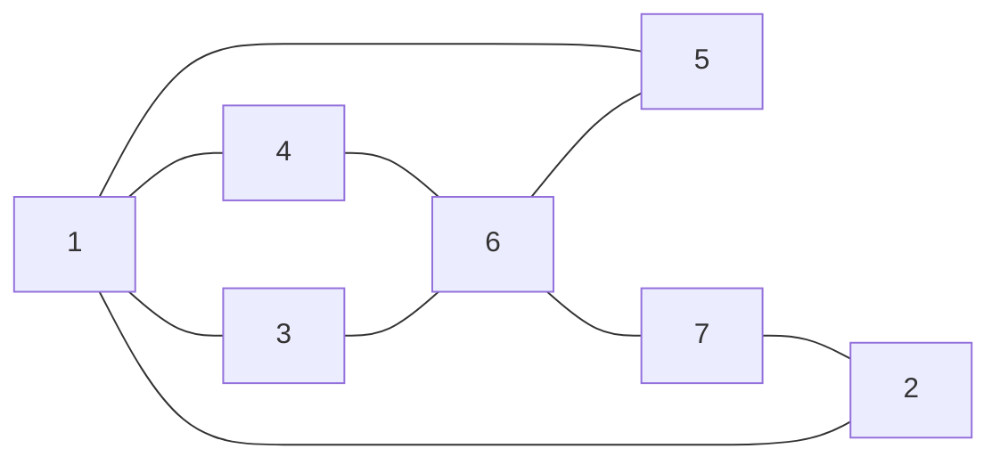
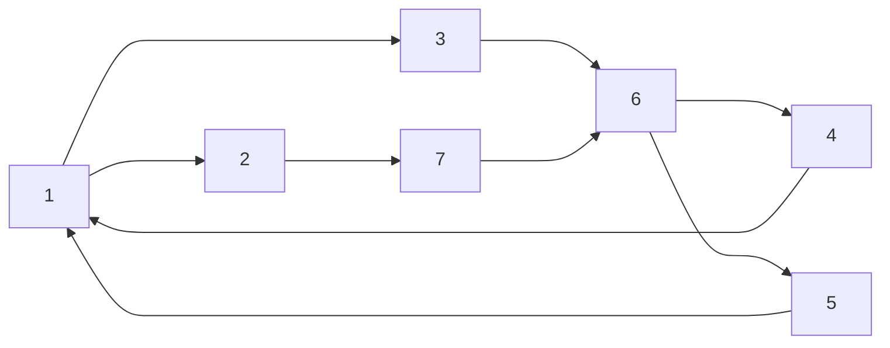

# Representing graphs
A graph $G=\left( V,E \right)$ has a pair of sets: vertices $V$ and edges $E$

To give an **adjacency list** representation of a graph:
- For each vertex $v$ list all of the vertices adjacent to $v$
- Each vertex points to the next in a list

To give an **adjacency matrix** representation of a graph:
- Create a square matrix $A$ and label the rows and columns with the vertices:
	- The entry in row $i$ column $j$ is $1$ if vertex $j$ is adjacent to vertex $i$
	- $0$ if not

Can also represent a graph by an array of its edges

## Undirected

$1: 2,3,4,5$
$2:1,7$
$3:1,6$
$4:1.6$
$5:1,6$
$6:3,4,5,7$
$7:2,6$

$$\begin{pmatrix}  
0 & 1 & 1 &1&1&0&0\\ 
1 & 0 & 0 &0&0&0&1\\
1 & 0 & 0 &0&0&1&0\\
1 & 0 & 0 &0&0&1&0\\
1 & 0 & 0 &0&0&1&0\\
0 & 0 & 1 &1&1&0&1\\
0 & 1 & 0 &0&0&1&0
\end{pmatrix}$$

$$A^T = A$$

## Directed

$1: 2,3$
$2:7$
$3:6$
$4:1$
$5:1$
$6:4,5$
$7:6$

$$\begin{pmatrix}  
0 & 1 & 1 & 0 & 0 & 0 & 0\\ 
0 & 0 & 0 & 0 & 0 & 0 & 1\\
0 & 0 & 0 & 0 & 0 & 1 & 0\\
1 & 0 & 0 & 0 & 0 & 0 & 0\\
1 & 0 & 0 & 0 & 0 & 0 & 0\\
0 & 0 & 0 & 1 & 1 & 0 & 0\\
0 & 0 & 0 & 0 & 0 & 1 & 0
\end{pmatrix}$$

# Breadth-First Search (Graph Traversal)
Input: a graph $G=\left(V,E\right)$ and a source vertex $s$
Aim: To find the **distance** from $s$ to each of the other vertices in the graph

Works on both directed and undirected graphs

Idea: Send out a **wave** from $s$
- Then wave first hits vertices at distance $1$
- Then the wave hits vertices at distance $2$
- And so on

BFS maintains a **queue** that contains vertices that have been discovered but are waiting to be processes
BFS **colours** the vertices
- White indicates that a vertex is undiscovered
- Grey indicates that a vertex is discovered but unprocessed
- Black indicates that a vertex has been processed

The algorithm maintains an **array** $d$ (distance)
- $d[s] = 0$ where $s$ is the source vertex
- If we discover a new vertex $v$ while processing $u$, we set $d[v]=d[u]+1$

## Analysis of running time
We want an **upper bound** on the **worst-case** running time
- Assume that it takes constant time for each operation such as to test and update colours, to make changes to distance (and predecessor) and to enqueue and dequeue
- **Initialization** takes $O(V)$
- Each vertex enters (and leaves) the queue exactly once, so queuing operations take $O(V)$
- In the **loop** the adjacency lists of each vertex are scanned. Each list is read once, and the combined lengths of the lists is $O(E)$
- Thus the total running time is $O(V+E)$

## More than distances 
If we want to find the shortest-possible path from the source to each vertex we must store

- The highlighted edges (ones used to discover new vertices) form a tree: we call this the Breadth-first tree. A path from $s$ to another vertex $v$ through the tree is the shortest path between $s$ and $v$
- Thee predecessor of a vertex is the one from which it was discovered (its parent). We can record predecessors in an array $\pi$ when we run the algorithm and then use the array to construct the Breadth-first tree

## Algorithm

![[BFS algorithm.png]]

# Depth-first search
Depth-first search explores the graph (but does not find distances to the source)

In contracts to BFS, when a vertex is discovered, it is immediately explored
Two timestamps are recorded for each vertex, $d$ and $f$; the discovery and finish times. 

We can also record predecessors again
- Again colours are used:
	- White for undiscovered
	- Grey for discovered but not finished
	- Black for finished

## Algorithm
![[Pasted image 20240306121542.png]]
## Analysis
- Initialization takes time $O(V)$
- Time $O(V)$ is spent on incrementing time, colouring vertices and updating $d$ and $f$
- Each vertex in each adjacency list is considered at most once
	- This takes time $O(E)$
- Total time is $O(V+E)$

The edges used for discovering new vertices form the depth-first tree (or forest). Again, we can find this with a **predecessor array**

## Classification of the edges
Once we have obtained a DFS-forest for a graph, we can classify the edges of $G$

- **Tree** edges are those edges in the DFS-forest
- **Back** edges are edges that join a vertex to an ancestor
- **Forward** edges are edges not in the tree that join a vertex to its descendant
- **Cross** edges: all other edges

![[Pasted image 20240306122219.png]]