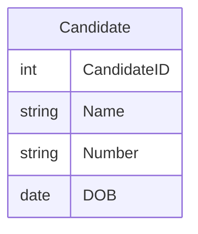
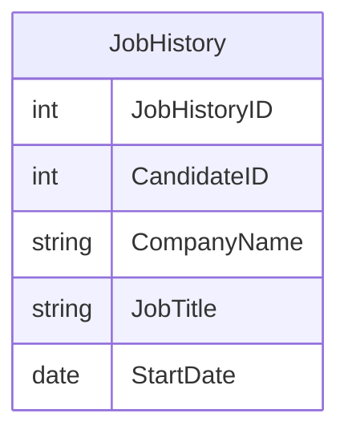
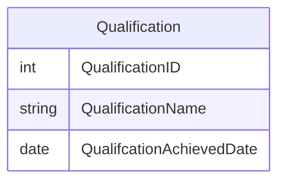
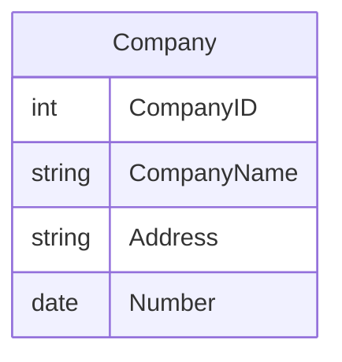
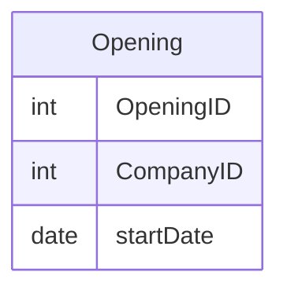
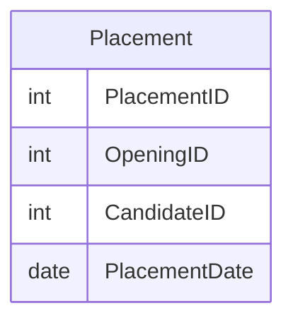
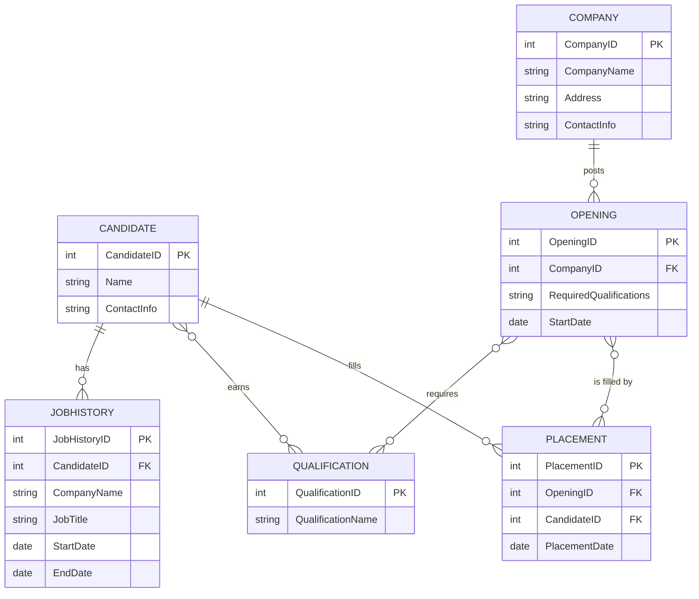
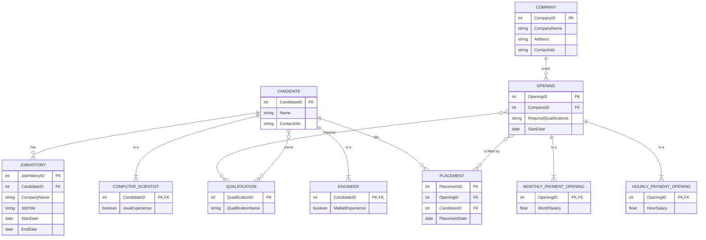
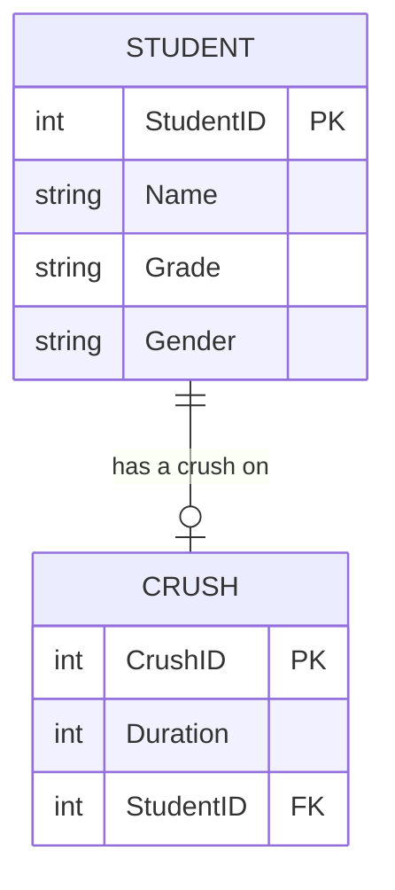
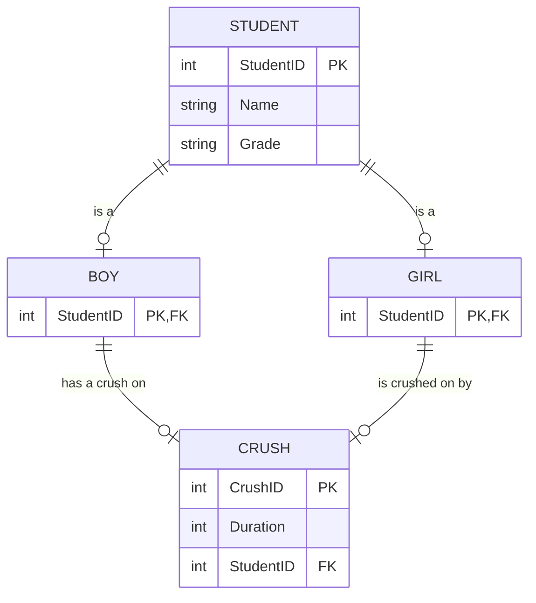

# Question 1
a)
- **Candidate**:

- **JobHistory**:

- **Qualification**:

- **Company**:

- **Opening**:

- **Placement**:

b)

c)

# Question 2

a)

6 authors in total:
min of 6
max of 12

An author can be associated with 1 or 2 books
A book can be written by 1 to 3 authors

min: 6 readers
max: 60 readers

b)

- **Minimum Number of Books**: 6
- **Maximum Number of Books**: 30
- **Minimum Number of Authors**: 6
- **Maximum Number of Authors**: 15

# Question 3
a)

b)

